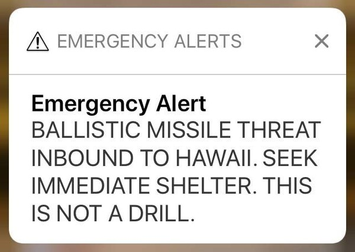
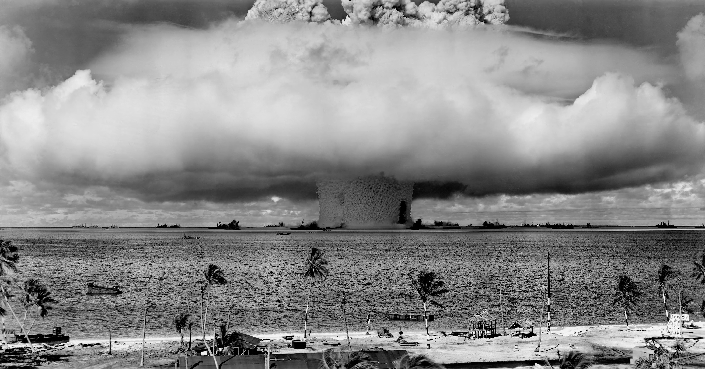

## Citizens against nuclear weapons in Berkeley:
### Update a Cold War law for modern times and advocate for a nuclear weapons free world.

The original Berkeley Nuclear Free Act measured passed by ballot measure in 1986. 
This was during the height of the cold war when over 60,000 weapons were stockpiled globally. 
Since the end of the Cold War, through various treaties, the number of nuclear weapons has decreased dramatically. 

However, they still pose a threat. 
As recently as January 2018, the residents of Hawaii thought a nuclear weapon had been launched at them. 
Even though this was a false alarm, it still shows the imminent threat of nuclear weapons today. 
It is time for them to go the way of chemical and biological weapons and be completely banned and eliminated.

Sign our petition today!

For more information, please email us at <nwfba2018@gmail.com>.

## Links:

[Frequently Ask Questions](FAQs.md)

[Upcoming Events](events.md)

[Full Text of 2018 Nuclear Weapons Free Berkeley Act](nwfba_2018.pdf)

[Title and Summary Assigned by Berkeley City Attorney](nwfba_2018_summ.pdf)

[Full Text of 1986 Nuclear Free Berkeley Act](nfba_1986.pdf)

[Support the campaign!](support.md)

