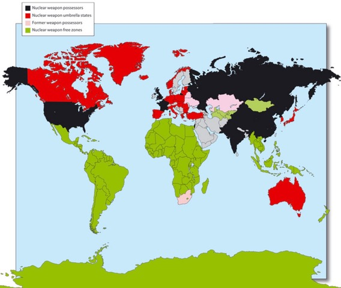

# Additional Resources on Nuclear Weapons

The Bulletin of the Atomic Scientists: Nuclear Notebook  
<https://thebulletin.org/nuclear-notebook-multimedia>

SF Chronicle article on Atomic Bomb Scare in the 1950s  
<https://www.sfchronicle.com/oursf/article/Atomic-bomb-scare-in-1950s-brought-the-city-on-11748126.php>

The Madman and the Bomb  
<https://www.politico.com/magazine/story/2017/08/11/donald-trump-nuclear-weapons-richard-nixon-215478>

Nuclear Weapons: Who Has What at a Glance  
<https://www.armscontrol.org/factsheets/Nuclearweaponswhohaswhat>

---
[Homepage](index.md)